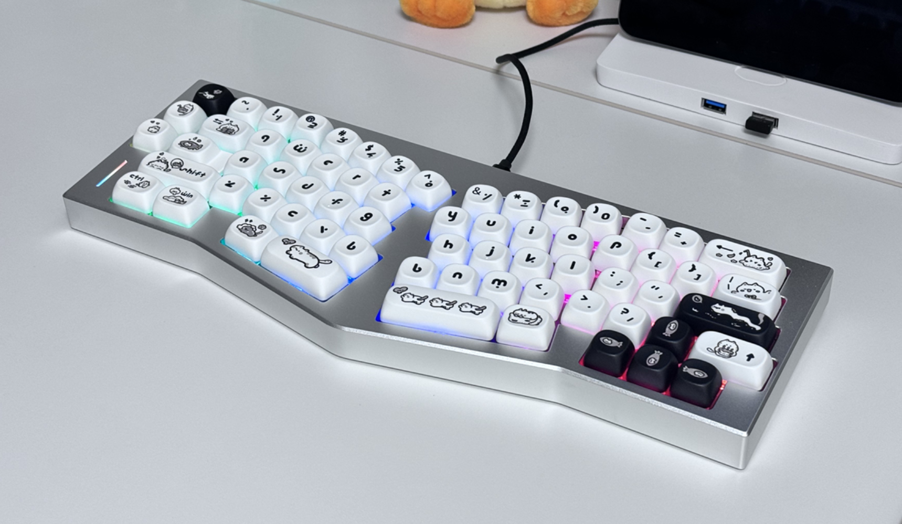
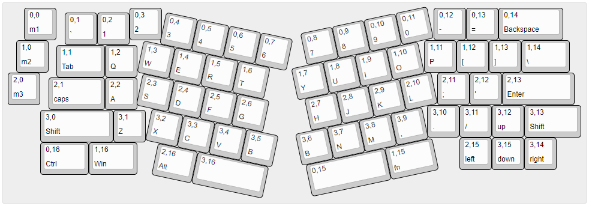
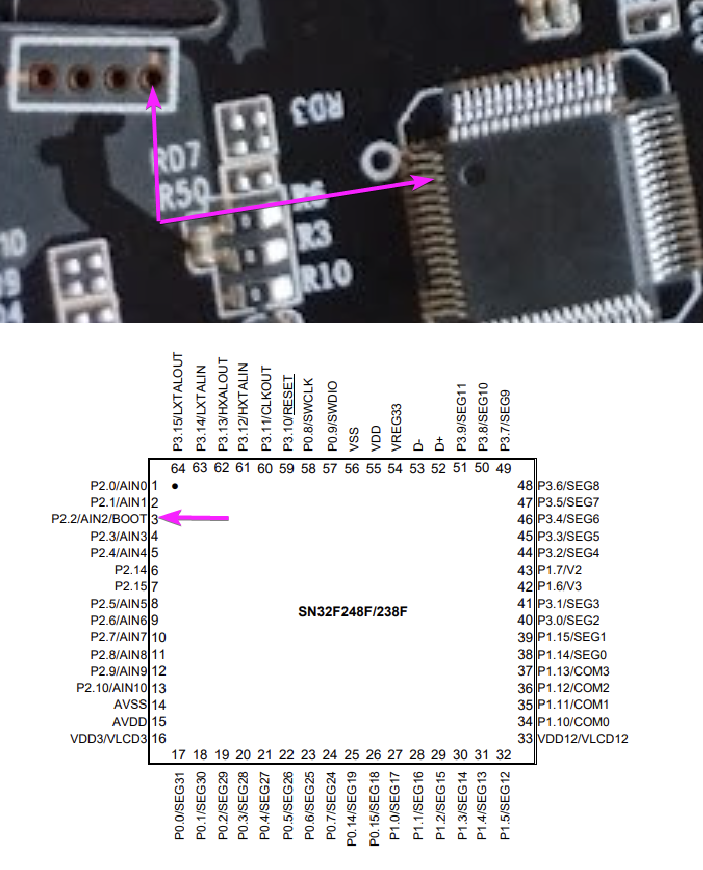
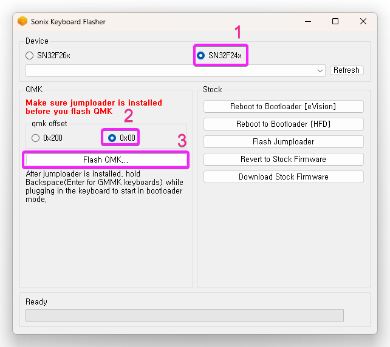

# Weikav Record Alice (IN DEVELOPMENT)



A QMK Keyboard device configs for Weikav Record Alice (Spring Clone)

## Overview

### Repo

- `Keyboard Maintainer` : [`paragonnov`](https://github.com/qkdxorjs1002)
- All of keyboard Resources -> Check `./data` folder out

### H/W

#### MCU

- `SN32F248F`
- [`Datasheet PDF`](data\SN32F248_V2.2_EN.pdf)

#### RGB Matrix

- `Multiplexer`
- `RBG SMD LED (?)`

#### Keyboard Matrix pin (GPIO)

- `Columns` : "C10", "C9", "C8", "C7", "C6", "C5", "C15", "C14", "C4", "C3", "C2", "C1", "C0", "D15", "D7", "D5", "D4"
- `Rows` : "B7", "B6", "D12", "D11"

#### VID / PID

- `Default` : VendorID=369B / ProductID=0051
- `Bootloader mode` : VendorID=0C45 / ProductID=7900

### S/W

### !!! IMPORTANT - SonixQMK Based Firmware

#### Layout and keymap

- [`KLE JSON`](data\keyboard-layout-editor.json)



## Instruction

### 1. Setup development environment

[Link - Come back to this page before running qmk setup!!!](https://docs.qmk.fm/#/newbs_getting_started?id=set-up-your-environment)

### 2. Prepare QMK source

```bash
qmk setup SonixQMK/qmk_firmware -b sn32_develop
```

Copy `keyboards` folder(in this repo), into QMK source's `keyboards`.

### 3. Build firmware

```bash
qmk compile -kb weikav/record -km default
```

### 4. Bootloader mode

#### The Sonix SN32F248 can be put in Bootloader mode by shorting the “BOOT” pin to ground (GND) before powering the board

#### The BOOT pin is located at pin 3 (see picture bellow), you will need to short this pin with GND



### 5. Flashing QMK

#### 5-1. Download Sonix Flasher

[`Download`](https://github.com/SonixQMK/sonix-flasher/releases)

#### 5-2. Flash firmware



### FactoryFW Recovery

#### Download and execute Factory FW Flasher `exe` (With Bootloader mode)

[`data\FactoryFW.zip` in this repo](data\FactoryFW.zip)

## License

[GPL-3.0 License](./LICENSE)